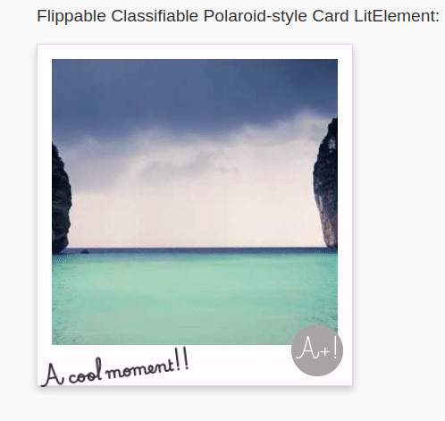

# \<lit-laroid>

This webcomponent was created with the [open-wc](https://github.com/open-wc/open-wc) generator.

I removed prettier and added standard, though.

## Description

Lit-laroid is a Flippable Classifiable Polaroid-style Card LitElement:



The content in the back of the card is slotted.

The component is 100% test-covered.

## Usage

```html
<script type="module">
  import 'lit-laroid/lit-laroid.js';
</script>

 render(
      html`
        <lit-laroid
          imageUrl='https://picsum.photos/400'
          caption='A cool moment!!'
          label='A+!'
        >
          <p>This content is slotted!</p>
        </lit-laroid>
      `,)
```

## Linting and formatting

To scan the project for linting and formatting errors, run

```bash
npm run lint
```

To automatically fix linting and formatting errors, run

```bash
npm run format
```

## Testing with Web Test Runner

To execute a single test run:

```bash
npm run test
```

To run the tests in interactive watch mode run:

```bash
npm run test:watch
```


## Tooling configs

For most of the tools, the configuration is in the `package.json` to minimize the amount of files in your project.


## Local Demo with `web-dev-server`

```bash
npm start
```

To run a local development server that serves the basic demo located in `demo/index.html`
